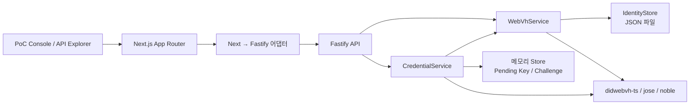

# WebVH VC/VP PoC 코드 리포트

> 작성일: 2026-08-19  
> 대상: `webvh-poc`  
> 목적: 리더 보고용 구현 현황, 구조, 저장 방식, 위험 요소 및 운영 전환 판단

## 1. 종합 결론

`webvh-poc`는 `did:webvh` 생성부터 VC 발급, VP 제출·검증, 키 회전까지 한 번에 검증하기 위한 독립형 상호운용성 PoC다.

핵심 기능은 정상 구현되어 있고 타입 검사, E2E 테스트 8건, 프로덕션 빌드도 모두 통과했다. 다만 현재 구조는 단일 프로세스 데모용이다. 인증 없는 키 회전, private JWK 평문 노출·저장, `/tmp` 파일 저장소, 메모리 기반 challenge 때문에 운영 서비스로 바로 전환할 수는 없다.

| 항목 | 평가 |
| --- | --- |
| 기술 검증 완성도 | 높음 |
| DID → VC → VP 전체 흐름 | 구현 완료 |
| 코드 구조 | PoC 규모에 적절 |
| 표준 프로파일 검증 | 구현 기준 양호 |
| 멀티 인스턴스 대응 | 미지원 |
| 키 보안 | 운영 부적합 |
| 운영 준비도 | 낮음 |

## 2. 무엇을 검증하기 위해 만들었나

이 프로젝트는 다음 흐름이 실제 코드로 성립하는지 검증한다.

1. Ed25519 키를 먼저 생성한다.
2. 최초 공개키에서 SS58 형식의 URL path를 만든다.
3. 해당 path를 포함한 `did:webvh` genesis를 생성한다.
4. DID history를 JSONL로 공개하고 hash chain과 proof를 검증한다.
5. Issuer DID의 `assertionMethod`로 `vc+jwt`를 발급한다.
6. Holder DID의 `authentication` 키로 `vp+jwt`를 생성한다.
7. Audience, nonce, challenge, replay, DID log, 서명, VC subject binding을 검증한다.
8. 키 회전 후에도 DID와 URL path는 유지되고 현재 공개키만 변경되는지 확인한다.

구현 범위와 외부 규격은 [`README.ko.md`](./README.ko.md)에 정리되어 있다.

## 3. 전체 구조



기술 스택은 다음과 같다.

- Node.js 22
- TypeScript 5.9
- Next.js 16 / React 19
- Fastify 5
- `didwebvh-ts` 2.8
- `jose` 6.2
- `@noble/curves` Ed25519
- Vitest 4

의존성과 실행 명령은 [`package.json`](./package.json)에 있다.

### 3.1 서버 구성의 특징

Next.js가 실제 HTTP 진입점이고, Fastify는 별도 포트로 뜨지 않는다. Next Route Handler가 요청을 받은 뒤 프로세스 내부 Fastify에 `app.inject()`로 전달한다.

- Next/Fastify 연결: [`src/next-api.ts`](./src/next-api.ts)
- API catch-all: [`app/api/[...path]/route.ts`](./app/api/[...path]/route.ts)
- DID JSONL catch-all: [`app/[...path]/route.ts`](./app/[...path]/route.ts)
- Fastify 조립: [`src/webvh-app.ts`](./src/webvh-app.ts)

이 구조는 동일한 Fastify 앱을 Next.js, CLI demo, 테스트에서 재사용할 수 있다는 장점이 있다. 반면 Fastify singleton은 프로세스 단위이므로 서버리스 인스턴스 간 상태는 공유되지 않는다.

## 4. 주요 모듈

| 모듈 | 책임 |
| --- | --- |
| [`src/webvh-app.ts`](./src/webvh-app.ts) | 서비스 조립, API 라우팅, 에러 응답 |
| [`src/webvh.ts`](./src/webvh.ts) | DID 생성·조회·검증·회전 |
| [`src/crypto.ts`](./src/crypto.ts) | Ed25519 키, Multibase, SS58, WebVH proof 서명 |
| [`src/credentials.ts`](./src/credentials.ts) | VC 발급·검증, VP 생성·검증 |
| [`src/store.ts`](./src/store.ts) | DID와 private key의 JSON 파일 저장 |
| [`src/holder-keys.ts`](./src/holder-keys.ts) | 생성 전 holder key의 10분 메모리 보관 |
| [`src/challenges.ts`](./src/challenges.ts) | nonce, audience, replay 상태 관리 |
| [`src/types.ts`](./src/types.ts) | DID log, document, identity 타입 |
| `public/*.html` | 단계별 Console과 API Explorer |

화면은 React 컴포넌트로 세밀하게 구성하지 않고 정적 HTML을 iframe으로 보여준다. PoC 개발 속도에는 유리하지만 `public/index.html`이 약 1,000줄짜리 단일 파일이라 기능 확장에는 불리하다.

## 5. 요청 및 처리 흐름

### 5.1 애플리케이션 시작

`createApp()`은 다음 순서로 서비스를 구성한다.

1. `IdentityStore` 생성 및 기존 JSON 파일 로드
2. `WebVhService` 생성
3. Issuer identity가 없으면 자동 생성
4. `ChallengeStore`와 `PendingHolderKeyStore` 생성
5. `CredentialService` 생성
6. Fastify route 등록

Issuer는 디스크에 기존 상태가 있으면 재사용한다. 과거 PoC 버전의 Multikey signing method가 발견되면 WebVH update를 수행해 `JsonWebKey` 방식으로 마이그레이션한다.

### 5.2 API 구성

| Method | Path | 역할 |
| --- | --- | --- |
| `GET` | `/health` | 서버와 issuer 상태 확인 |
| `GET` | `/api/issuer` | Issuer DID와 현재 DID Document 조회 |
| `POST` | `/api/keys` | Holder Ed25519 키와 one-time `keyId` 생성 |
| `GET` | `/api/dids` | 저장된 identity public projection 목록 |
| `POST` | `/api/dids` | `keyId`를 소비해 holder DID genesis 생성 |
| `GET` | `/api/dids/resolve` | 저장된 DID history 조회·검증 |
| `POST` | `/api/dids/validate` | 클라이언트가 보낸 DID log 검증 |
| `POST` | `/api/dids/rotate` | 현재 update/authentication key 회전 |
| `POST` | `/api/credentials` | VC 발급 |
| `POST` | `/api/credentials/verify` | VC 단독 검증 |
| `POST` | `/api/presentations/challenges` | VP challenge 발급 |
| `POST` | `/api/presentations` | Holder-signed VP 생성 |
| `POST` | `/api/verifications` | VP와 포함된 VC 검증 |
| `POST` | `/api/demo/run` | 전체 흐름 일괄 실행 |

## 6. DID 생성과 회전 방식

### 6.1 Holder DID 생성

Holder 생성 흐름은 다음과 같다.

- `/api/keys`에서 Ed25519 키 생성
- 공개키를 SS58 generic prefix `42`로 변환
- 생성된 SS58 값을 DID URL의 마지막 path로 사용
- one-time `keyId`를 10분간 메모리에 저장
- `/api/dids` 호출 시 `keyId`를 한 번만 소비
- `didwebvh-ts`로 WebVH genesis 생성
- DID document와 private key, 전체 history를 파일에 저장

키 생성과 SS58 변환은 [`src/crypto.ts`](./src/crypto.ts), DID 생성은 [`src/webvh.ts`](./src/webvh.ts)에 구현되어 있다.

Holder DID 형태는 다음과 같다.

```text
did:webvh:{SCID}:webvh-poc.vercel.app:{SS58_INITIAL_PUBLIC_KEY}
```

Issuer는 다음 path를 사용하며 서버 시작 시 없으면 자동 생성한다.

```text
did:webvh:{SCID}:webvh-poc.vercel.app:issuer:poc
```

마지막 SS58 path는 WebVH 표준 요구사항이 아니라 이 PoC가 정한 식별 규칙이다.

### 6.2 DID log 검증

`didwebvh-ts`의 `resolveDIDFromLog()`를 사용해 다음을 검증한다.

- SCID
- entry hash chain
- update proof
- 요청한 DID와 최종 document ID 일치
- configured domain 일치
- DID log entry 최대 100개

임의 외부 WebVH URL을 가져오지 않고 서버가 저장한 로그 또는 클라이언트가 직접 전달한 로그만 검증한다.

### 6.3 키 회전

회전 시 새 Ed25519 키를 만들고 기존 키로 WebVH update를 서명한다.

- DID 유지
- SCID 유지
- URL path 유지
- verification method와 공개키 변경
- DID history에 새 entry 추가

현재 검증 정책은 최신 DID Document의 현재 키만 허용한다. 따라서 회전 전 holder key로 만든 VP는 회전 후 거절된다. Issuer 키를 회전할 경우 기존 VC를 검증하기 위한 역사적 키 조회 정책도 별도로 필요하다.

## 7. VC와 VP 구성

### 7.1 VC 발급

Issuer의 `assertionMethod` Ed25519 키로 서명한다.

- JOSE header: `alg=EdDSA`, `typ=vc+jwt`, `cty=vc`
- VCDM 2.0 속성을 JWT 최상위에 배치
- 기존 `vc` 중첩 claim 금지
- `iss`, `sub`, `jti`와 VCDM 필드 정합성 유지
- `validFrom`, `validUntil`, `iat`, `exp` 적용
- 발급 가능한 issuer는 내장 issuer 한 곳으로 제한

구현은 [`src/credentials.ts`](./src/credentials.ts)의 `issueCredential()`에 있다.

현재 `WebVHExampleCredential`과 임의 subject claim은 `undefined-terms/v2` context를 사용한다. 실제 상호운용 credential로 전환하려면 공개되고 안정적인 application vocabulary와 claim schema를 정의해야 한다.

### 7.2 VP 생성과 검증

VP에는 VC JWT를 다음 형태로 포함한다.

```text
data:application/vc+jwt,<compact-jwt>
```

검증 항목은 다음과 같다.

- challenge 존재와 TTL
- challenge 상태 `open → verifying → used`
- exact audience
- nonce
- replay
- holder DID log
- holder의 현재 `authentication` method
- VP 서명
- issuer DID log
- issuer `assertionMethod`
- VC 서명과 유효기간
- `credentialSubject.id === VP holder`

검증 실패 시 challenge를 다시 `open`으로 돌려 정상 요청을 재시도할 수 있게 했고, 성공한 경우에만 `used`로 전환한다.

## 8. 스토어 구성

DB는 사용하지 않는다.

저장 구조는 대략 다음과 같다.

```text
/tmp/webvh-poc/webvh-poc.vercel.app/
└── private/
    ├── <base64url(holder-path)>.json
    └── <base64url(issuer-path)>.json
```

각 JSON 파일에는 다음 정보가 함께 저장된다.

- role과 path
- DID
- 최신 DID Document
- 전체 DID log
- 현재 key ID
- public Multibase key
- public JWK
- private JWK
- 생성·수정 시각

구체적인 저장 타입은 [`src/types.ts`](./src/types.ts)의 `StoredIdentity`에 있다.

스토어는 다음과 같이 동작한다.

- 시작 시 `private/*.json`을 전부 읽어 메모리 Map 구성
- DID와 path 두 가지 index 유지
- 디렉터리 권한 `0700`
- 파일 권한 `0600`
- 임시 파일 작성 후 `rename()`으로 교체

구현은 [`src/store.ts`](./src/store.ts)에 있다.

장점은 구현이 단순하고 단일 프로세스 테스트를 재현하기 쉽다는 것이다. 한계는 다음과 같다.

- private key 암호화 없음
- KMS/HSM 없음
- 파일 스키마 버전 없음
- 저장 레코드 전체 validation 없음
- 프로세스 간 locking 없음
- 트랜잭션·백업·복구 없음
- `/tmp`이므로 Vercel과 Docker container 재생성 시 데이터 유실 가능
- 여러 Vercel 인스턴스가 서로 다른 issuer와 holder 상태를 가질 수 있음

Pending holder key와 challenge는 파일에도 저장하지 않고 프로세스 메모리에만 둔다. 재시작 시 모두 사라진다.

## 9. 화면과 API Explorer

두 개의 정적 UI를 제공한다.

- `public/index.html`: DID → VC → VP → rotation 단계별 Console
- `public/api-doc.html`: 요청을 편집하고 직접 호출할 수 있는 same-origin API Explorer

Next.js 페이지는 [`app/poc-frame.tsx`](./app/poc-frame.tsx)의 iframe을 사용해 정적 HTML을 표시한다. UI는 응답에서 얻은 `keyId`, DID, VC JWT, challenge ID, VP JWT를 브라우저 메모리에서 다음 단계로 전달한다.

실제 OpenAPI document에서 UI를 생성하는 방식은 아니므로 route와 정적 문서 사이의 contract drift 가능성이 있다.

## 10. 보안 및 운영 리스크

가장 중요한 항목 순서다.

| 우선순위 | 리스크 | 영향 |
| --- | --- | --- |
| 매우 높음 | `/api/dids/rotate`에 인증·권한 없음 | DID를 아는 사용자가 holder뿐 아니라 issuer 키도 회전시킬 수 있음 |
| 매우 높음 | `/api/keys`가 private JWK 반환 | 브라우저·로그·프록시를 통한 키 유출 가능 |
| 매우 높음 | private JWK 평문 파일 저장 | 파일 접근 시 issuer와 holder 키 전체 유출 |
| 높음 | `/tmp` 단일 인스턴스 저장소 | 재시작·스케일아웃 시 DID/issuer 불일치 |
| 높음 | API 전체에 인증·rate limit·audit 없음 | 임의 키 생성, DID 생성, VC 발급, 회전 가능 |
| 높음 | Holder가 서버에 내장됨 | 실제 wallet/holder custody 구조가 아님 |
| 중간 | 현재 키만 검증 | 회전 전 발급된 서명의 역사적 검증 정책 부재 |
| 중간 | 정적 API 문서 | 실제 route와 문서가 변경될 때 contract drift 가능 |
| 중간 | 임의 claims 허용 | 실제 credential vocabulary/schema 통제가 없음 |
| 중간 | 복구·폐기 기능 없음 | key recovery, VC status/revocation, witness 미지원 |
| 중간 | OID4VCI/OID4VP 미지원 | 표준 wallet/issuer/verifier 연동 불가 |

프로젝트도 이 범위 제한을 [`README.ko.md`](./README.ko.md#보안-및-범위-제한)에 명시하고 있다.

### 10.1 현재 적용된 방어 로직

PoC 수준에서 다음 방어 로직은 적용되어 있다.

- 요청 body 1MB 제한
- `did:webvh` domain allowlist
- DID log 최대 100 entries 제한
- public JWK에 private `d` 필드가 없는지 확인
- Ed25519 public key 길이와 canonical base64url 검증
- `alg`, `typ`, `cty`, `kid` 검증
- issuer allowlist
- audience exact match
- nonce와 challenge TTL
- challenge 동시 검증 상태와 replay 방지
- VC subject와 VP holder binding
- 변조된 DID log, VC, VP의 fail-closed 처리

## 11. 테스트 및 현재 상태

2026-08-19 로컬에서 다음 검증을 실행했다.

```text
npm run check  → 통과
npm test       → 1 test file, 8 tests 통과
npm run build  → Next.js production build 통과
```

배포는 수행하지 않았다.

테스트는 다음을 다룬다.

- 화면과 API Explorer 제공
- DID 생성·resolve
- VC 발급·검증
- challenge 기반 VP 검증과 replay 거절
- 변조된 DID log 거절
- 변조된 VP 거절 후 정상 재시도
- 다른 holder의 VC 사용 거절
- 키 회전과 이전 키 거절
- 기존 Multikey issuer의 JsonWebKey 자동 마이그레이션

테스트 코드는 [`test/e2e.test.ts`](./test/e2e.test.ts)에 있다.

아직 부족한 테스트는 다음과 같다.

- 멀티 프로세스 파일 충돌
- pending key와 challenge 만료
- 손상되거나 부분 작성된 저장 파일
- issuer 회전 후 기존 VC 검증
- 인증·권한 및 rate limit
- Vercel cold start와 멀티 인스턴스
- 키 저장 실패와 복구

## 12. 리더 의사결정 제안

이 코드는 “WebVH DID를 실제로 만들고 VC/VP까지 연결할 수 있는가”를 검증하는 데는 성공했다. 그대로 운영화하기보다 핵심 프로토콜 모듈을 재사용하는 방향이 적절하다.

운영 전환 우선순위는 다음과 같다.

1. private key를 서버 응답에서 제거하고 KMS/HSM 또는 wallet custody로 분리
2. 파일 스토어를 영속 DB/object store로 교체
3. challenge와 nonce를 Redis/DB 기반 one-time store로 교체
4. DID 생성·회전·VC 발급 API에 인증과 소유권 검증 추가
5. Issuer와 Holder 실행 경계 분리
6. 역사적 DID version을 이용한 회전 전 서명 검증 정책 설계
7. 실제 credential vocabulary, status/revocation 도입
8. 필요하면 OID4VCI/OID4VP 프로토콜로 확장

최종적으로 이 PoC는 기술 방향 검증용으로는 충분하지만, 운영 기반으로 평가하면 키 custody와 영속 상태 계층을 새로 설계해야 하는 단계다.

## 13. 생성·저장·UI 노출 데이터 예시

아래 값은 코드의 실제 응답 구조를 바탕으로 만든 마스킹 예시다. 실제 저장 파일이나 실제 private key를 복사한 값이 아니며, `...`와 `<REDACTED>`는 생략 또는 비밀 값 마스킹을 뜻한다.

### 13.1 데이터별 생성·저장·노출 범위

| 데이터 | 생성 위치 | 서버 저장 | UI 노출 | 비고 |
| --- | --- | --- | --- | --- |
| Pending holder key | `POST /api/keys` | 프로세스 메모리, 최대 10분 | public/private JWK 모두 노출 | `keyId` 사용 시 메모리에서 즉시 제거 |
| Issuer/Holder identity | 시작 시 또는 `POST /api/dids` | `DATA_DIR/private/*.json` | private JWK를 제외한 public projection 노출 | 저장 파일에는 private JWK 포함 |
| DID Document | DID 생성·회전 시 | identity JSON과 DID log에 저장 | identity/resolve 화면에 노출 | public 정보 |
| DID log | DID 생성·회전 시 | identity JSON에 배열로 저장 | `did.jsonl`, resolve/validation 결과에 노출 | 공개 resolution 데이터 |
| VC JWT | `POST /api/credentials` | 별도 영속 저장 안 함 | compact JWT 원문과 ID 노출 | 브라우저 메모리에서 VP 생성 단계로 전달 |
| Challenge | `POST /api/presentations/challenges` | 프로세스 메모리 | ID, nonce, audience, 만료 시각 노출 | 검증 성공 시 `used` 처리 |
| VP JWT | `POST /api/presentations` | 별도 영속 저장 안 함 | compact JWT 원문 노출 | 내부에 VC JWT를 enveloped credential로 포함 |
| Verification result | `POST /api/verifications` | 별도 영속 저장 안 함 | 검증 항목별 성공 결과 노출 | challenge 상태만 메모리에 유지 |
| Rotation result | `POST /api/dids/rotate` | 갱신된 identity와 DID log 저장 | 이전/현재 key ID와 공개키 노출 | private key는 rotation 응답에 포함하지 않음 |

### 13.2 Holder key 생성 응답

Console의 “Holder Key 생성” 단계와 API Explorer에서 다음 형태가 표시된다.

```json
{
  "keyId": "8ed62d26-7ec7-4a7f-9609-751bf81cfc53",
  "algorithm": "Ed25519",
  "purpose": "authentication + WebVH update (PoC combined key)",
  "publicKeyMultibase": "z6MkvExamplePublicMultibaseKey...",
  "publicJwk": {
    "kty": "OKP",
    "crv": "Ed25519",
    "x": "ExamplePublicKeyBase64Url...",
    "alg": "EdDSA",
    "kid": "ExampleJwkThumbprint..."
  },
  "privateJwk": {
    "kty": "OKP",
    "crv": "Ed25519",
    "x": "ExamplePublicKeyBase64Url...",
    "d": "<REDACTED_PRIVATE_KEY>",
    "alg": "EdDSA",
    "kid": "ExampleJwkThumbprint..."
  },
  "ss58Prefix": 42,
  "pathId": "5ExampleSs58InitialPublicKeyPath...",
  "createdAt": "2026-08-19T08:00:00.000Z",
  "expiresAt": "2026-08-19T08:10:00.000Z",
  "privateKeyReturned": true
}
```

이 응답의 `privateJwk.d`는 실제 비밀 키다. 현재 PoC에서는 키 생성 과정을 관찰하기 위해 UI에 그대로 표시하지만, 운영 환경에서는 응답과 브라우저 상태에서 모두 제거해야 한다.

### 13.3 서버에 저장되는 identity JSON

`POST /api/dids`가 pending key를 소비한 뒤 `DATA_DIR/private/<base64url-path>.json`에 다음과 같은 레코드를 저장한다.

```json
{
  "role": "holder",
  "slug": "5ExampleSs58InitialPublicKeyPath...",
  "path": "5ExampleSs58InitialPublicKeyPath...",
  "did": "did:webvh:QmExampleScid:webvh-poc.vercel.app:5ExampleSs58InitialPublicKeyPath...",
  "didDocument": {
    "@context": [
      "https://www.w3.org/ns/did/v1"
    ],
    "id": "did:webvh:QmExampleScid:webvh-poc.vercel.app:5ExampleSs58InitialPublicKeyPath...",
    "authentication": [
      "did:webvh:QmExampleScid:webvh-poc.vercel.app:5ExampleSs58InitialPublicKeyPath...#ExampleJwkThumbprint"
    ],
    "verificationMethod": [
      {
        "id": "did:webvh:QmExampleScid:webvh-poc.vercel.app:5ExampleSs58InitialPublicKeyPath...#ExampleJwkThumbprint",
        "type": "JsonWebKey",
        "controller": "did:webvh:QmExampleScid:webvh-poc.vercel.app:5ExampleSs58InitialPublicKeyPath...",
        "publicKeyJwk": {
          "kty": "OKP",
          "crv": "Ed25519",
          "x": "ExamplePublicKeyBase64Url...",
          "alg": "EdDSA",
          "kid": "ExampleJwkThumbprint..."
        }
      }
    ]
  },
  "log": [
    {
      "versionId": "1-QmExampleVersionHash...",
      "versionTime": "2026-08-19T08:00:01Z",
      "parameters": {
        "method": "did:webvh:1.0",
        "scid": "QmExampleScid...",
        "updateKeys": [
          "z6MkvExamplePublicMultibaseKey..."
        ],
        "portable": false
      },
      "state": {
        "id": "did:webvh:QmExampleScid:webvh-poc.vercel.app:5ExampleSs58InitialPublicKeyPath...",
        "verificationMethod": ["..."]
      },
      "proof": [
        {
          "type": "DataIntegrityProof",
          "cryptosuite": "eddsa-jcs-2022",
          "verificationMethod": "did:key:z6MkvExample...#z6MkvExample...",
          "created": "2026-08-19T08:00:01Z",
          "proofPurpose": "authentication",
          "proofValue": "zExampleProofValue..."
        }
      ]
    }
  ],
  "key": {
    "kid": "did:webvh:QmExampleScid:webvh-poc.vercel.app:5ExampleSs58InitialPublicKeyPath...#ExampleJwkThumbprint",
    "publicKeyMultibase": "z6MkvExamplePublicMultibaseKey...",
    "publicJwk": {
      "kty": "OKP",
      "crv": "Ed25519",
      "x": "ExamplePublicKeyBase64Url...",
      "alg": "EdDSA",
      "kid": "ExampleJwkThumbprint..."
    },
    "privateJwk": {
      "kty": "OKP",
      "crv": "Ed25519",
      "x": "ExamplePublicKeyBase64Url...",
      "d": "<REDACTED_PRIVATE_KEY>",
      "alg": "EdDSA",
      "kid": "ExampleJwkThumbprint..."
    }
  },
  "createdAt": "2026-08-19T08:00:01.000Z"
}
```

UI의 DID 생성·목록 화면에는 위 레코드 전체가 아니라 다음 public projection만 표시된다.

```json
{
  "role": "holder",
  "pathId": "5ExampleSs58InitialPublicKeyPath...",
  "logPath": "/5ExampleSs58InitialPublicKeyPath.../did.jsonl",
  "did": "did:webvh:QmExampleScid:webvh-poc.vercel.app:5ExampleSs58InitialPublicKeyPath...",
  "logUrl": "https://webvh-poc.vercel.app/5ExampleSs58InitialPublicKeyPath.../did.jsonl",
  "didDocument": {
    "id": "did:webvh:QmExampleScid:webvh-poc.vercel.app:5ExampleSs58InitialPublicKeyPath...",
    "authentication": ["..."],
    "verificationMethod": ["..."]
  },
  "createdAt": "2026-08-19T08:00:01.000Z",
  "updatedAt": null,
  "currentKid": "did:webvh:QmExampleScid:webvh-poc.vercel.app:5ExampleSs58InitialPublicKeyPath...#ExampleJwkThumbprint",
  "currentPublicKeyMultibase": "z6MkvExamplePublicMultibaseKey...",
  "versionId": "1-QmExampleVersionHash...",
  "logEntries": 1,
  "pathDerivedFromInitialPublicKey": true
}
```

### 13.4 발급되는 VC JWT와 decoded payload

VC 발급 API는 compact JWT 원문을 UI에 표시한다.

```json
{
  "credentialJwt": "eyJhbGciOiJFZERTQSIsInR5cCI6InZjK2p3dCIsImN0eSI6InZjIiwia2lkIjoiLi4uIn0.eyJAY29udGV4dCI6Wy4uLl19.<SIGNATURE>",
  "credentialId": "urn:uuid:b497e9f1-b764-496e-a801-6528aa45f0be",
  "issuerDid": "did:webvh:QmIssuerScid:webvh-poc.vercel.app:issuer:poc",
  "type": "WebVHExampleCredential"
}
```

JWT payload를 해석하면 다음과 같은 구조다.

```json
{
  "@context": [
    "https://www.w3.org/ns/credentials/v2",
    "https://www.w3.org/ns/credentials/undefined-terms/v2"
  ],
  "id": "urn:uuid:b497e9f1-b764-496e-a801-6528aa45f0be",
  "type": [
    "VerifiableCredential",
    "WebVHExampleCredential"
  ],
  "issuer": "did:webvh:QmIssuerScid:webvh-poc.vercel.app:issuer:poc",
  "validFrom": "2026-08-19T08:01:00.000Z",
  "validUntil": "2026-08-19T09:01:00.000Z",
  "credentialSubject": {
    "name": "WebVH PoC Holder",
    "participation": "active",
    "id": "did:webvh:QmExampleScid:webvh-poc.vercel.app:5ExampleSs58InitialPublicKeyPath..."
  },
  "iss": "did:webvh:QmIssuerScid:webvh-poc.vercel.app:issuer:poc",
  "sub": "did:webvh:QmExampleScid:webvh-poc.vercel.app:5ExampleSs58InitialPublicKeyPath...",
  "jti": "urn:uuid:b497e9f1-b764-496e-a801-6528aa45f0be",
  "iat": 1787126460,
  "exp": 1787130060
}
```

VC JWT는 서버 파일에 따로 저장하지 않는다. Console과 API Explorer의 브라우저 메모리에 보관했다가 VP 생성 요청에 다시 사용한다.

### 13.5 Challenge와 VP 데이터

Challenge 생성 결과는 다음과 같다.

```json
{
  "id": "f18c72de-cd54-4a61-96cb-ec5501e7b0da",
  "nonce": "ExampleRandomNonceBase64Url...",
  "audience": "https://webvh-poc.vercel.app/verifier",
  "expectedHolderDid": "did:webvh:QmExampleScid:webvh-poc.vercel.app:5ExampleSs58InitialPublicKeyPath...",
  "expiresAt": "2026-08-19T08:07:00.000Z",
  "status": "open"
}
```

VP 생성 결과는 compact JWT 원문으로 UI에 표시된다.

```json
{
  "presentationJwt": "eyJhbGciOiJFZERTQSIsInR5cCI6InZwK2p3dCIsImN0eSI6InZwIiwia2lkIjoiLi4uIn0.eyJAY29udGV4dCI6Wy4uLl19.<SIGNATURE>"
}
```

VP JWT의 decoded payload는 다음 형태다.

```json
{
  "@context": [
    "https://www.w3.org/ns/credentials/v2",
    "https://www.w3.org/ns/credentials/undefined-terms/v2"
  ],
  "id": "urn:uuid:b6734a0a-ad4e-42ad-a7b2-7589c51bb156",
  "type": [
    "VerifiablePresentation"
  ],
  "holder": "did:webvh:QmExampleScid:webvh-poc.vercel.app:5ExampleSs58InitialPublicKeyPath...",
  "nonce": "ExampleRandomNonceBase64Url...",
  "verifiableCredential": [
    {
      "@context": "https://www.w3.org/ns/credentials/v2",
      "id": "data:application/vc+jwt,<FULL_COMPACT_VC_JWT>",
      "type": "EnvelopedVerifiableCredential"
    }
  ],
  "aud": "https://webvh-poc.vercel.app/verifier",
  "jti": "urn:uuid:b6734a0a-ad4e-42ad-a7b2-7589c51bb156",
  "iat": 1787126520,
  "exp": 1787126640
}
```

VP 안에는 전체 VC JWT가 포함되므로, VP 원문을 화면이나 로그에 노출하면 VC의 subject claim도 함께 노출된다는 점에 주의해야 한다.

### 13.6 검증 및 회전 결과

정상 VP 검증 결과는 다음과 같이 항목별 성공 여부를 보여준다.

```json
{
  "verified": true,
  "challengeId": "f18c72de-cd54-4a61-96cb-ec5501e7b0da",
  "holderDid": "did:webvh:QmExampleScid:webvh-poc.vercel.app:5ExampleSs58InitialPublicKeyPath...",
  "credentialId": "urn:uuid:b497e9f1-b764-496e-a801-6528aa45f0be",
  "issuerDid": "did:webvh:QmIssuerScid:webvh-poc.vercel.app:issuer:poc",
  "credentialType": [
    "VerifiableCredential",
    "WebVHExampleCredential"
  ],
  "checks": {
    "challenge": true,
    "audience": true,
    "nonce": true,
    "replay": true,
    "holderDidLog": true,
    "presentationSignature": true,
    "issuerDidLog": true,
    "credentialSignature": true,
    "subjectBinding": true
  }
}
```

키 회전 후에는 public key 변경 내역과 유지된 DID/path가 표시된다.

```json
{
  "did": "did:webvh:QmExampleScid:webvh-poc.vercel.app:5ExampleSs58InitialPublicKeyPath...",
  "pathId": "5ExampleSs58InitialPublicKeyPath...",
  "currentKid": "did:webvh:QmExampleScid:webvh-poc.vercel.app:5ExampleSs58InitialPublicKeyPath...#NewJwkThumbprint",
  "currentPublicKeyMultibase": "z6MkvNewPublicMultibaseKey...",
  "versionId": "2-QmExampleRotatedVersionHash...",
  "logEntries": 2,
  "rotation": {
    "previousKid": "did:webvh:QmExampleScid:webvh-poc.vercel.app:5ExampleSs58InitialPublicKeyPath...#OldJwkThumbprint",
    "currentKid": "did:webvh:QmExampleScid:webvh-poc.vercel.app:5ExampleSs58InitialPublicKeyPath...#NewJwkThumbprint",
    "previousPublicKeyMultibase": "z6MkvOldPublicMultibaseKey...",
    "currentPublicKeyMultibase": "z6MkvNewPublicMultibaseKey...",
    "didChanged": false,
    "pathChanged": false,
    "versionId": "2-QmExampleRotatedVersionHash..."
  }
}
```

이 예시에서 UI에 노출되는 가장 민감한 데이터는 초기 `privateJwk`, 전체 VC JWT, 전체 VP JWT다. 운영 UI에서는 private JWK는 완전히 제거하고, VC/VP 원문은 권한 있는 디버그 화면에서만 마스킹·단기 노출하는 정책이 필요하다.
